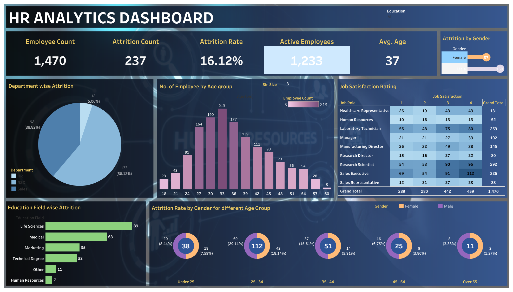

# 📊 HR Analytics Dashboard (Tableau)

An interactive **HR Analytics Dashboard** built using **Tableau Public** to analyze employee attrition, workforce demographics, job satisfaction, and departmental performance. The dashboard helps HR professionals identify key factors influencing employee attrition and make data-driven decisions.

---

## 📌 Project Overview

Employee attrition is one of the biggest challenges organizations face. This dashboard provides a comprehensive analysis of workforce data, enabling HR teams to monitor employee trends and identify areas requiring attention.

The dashboard presents various KPIs and interactive visualizations to understand employee distribution, attrition patterns, job satisfaction, education background, and age demographics.

---

## 🚀 Dashboard Preview



---

## 📈 Key Performance Indicators (KPIs)

- **Employee Count:** 1,470
- **Attrition Count:** 237
- **Attrition Rate:** 16.12%
- **Active Employees:** 1,233
- **Average Employee Age:** 37 Years

---

## 📊 Dashboard Features

### Employee Overview
- Total Employees
- Active Employees
- Average Age
- Attrition Count
- Attrition Rate

### Attrition Analysis
- Department-wise Attrition
- Gender-wise Attrition
- Education Field-wise Attrition
- Age Group-wise Attrition

### Workforce Demographics
- Employee Distribution by Age Group
- Employee Distribution by Gender
- Education Background

### Employee Satisfaction
- Job Satisfaction Ratings by Job Role

### Interactive Filtering
- Education Filter

---

## 📁 Dataset

The dashboard uses the **HR Employee Dataset**, containing information such as:

- Employee Demographics
- Department
- Education
- Gender
- Age
- Job Role
- Job Satisfaction
- Attrition Status

---

## 🛠️ Tools & Technologies

- Tableau Public
- Microsoft Excel
- Data Visualization
- Dashboard Design
- Data Analysis

---

## 📂 Project Structure

```
HR-Analytics-Dashboard/
│
├── Tableau Project.twbx
├── HR Data.xlsx
├── Dashboard.png
├── README.md
```

---

## 📌 Insights Generated

- Overall employee attrition rate is **16.12%**.
- Sales department experiences the highest employee attrition.
- Employees aged **25–34 years** show the highest attrition.
- Life Sciences contributes the largest share of employee attrition by education field.
- Job satisfaction varies significantly across different job roles.
- Male employees exhibit a higher attrition count than female employees.

---

## 🎯 Business Objective

This dashboard enables HR teams to:

- Monitor workforce health
- Identify departments with high attrition
- Understand employee demographics
- Analyze job satisfaction
- Support strategic HR decision-making
- Improve employee retention

---

## 💡 Skills Demonstrated

- Data Cleaning
- Data Visualization
- Dashboard Development
- KPI Design
- Interactive Dashboard Creation
- HR Analytics
- Business Intelligence
- Storytelling with Data

---

## 📸 Dashboard Components

- KPI Cards
- Pie Chart
- Histogram
- Bar Chart
- Donut Charts
- Highlight Table
- Interactive Filter

---

## ▶️ How to Use

1. Download or clone this repository.
2. Open `Tableau Project.twbx` using Tableau Public/Desktop.
3. Explore the interactive dashboard.
4. Use the Education filter to analyze different employee groups.

---

## 📬 Contact

**Akshita Gupta**

- GitHub: https://github.com/akshitaaa1
- LinkedIn: https://www.linkedin.com/in/akshita-gupta--

---

## ⭐ If you found this project useful, consider giving it a star!
